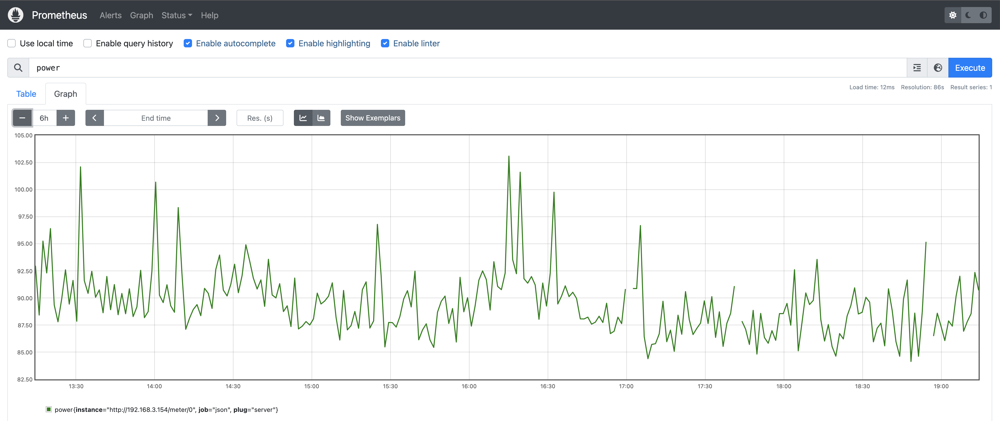

# proxmox-monitoring
A toolset to gather temperature and power consumption metrics then collect in Prometheus

# Architecture

```

                                                  PROXMOX SERVER
                   +---------------------------------------------------------------------------------+
                   |                   pve host                                                      |
                   |                  +-----------------------------------------------------------+  |
                   |     +-----+      |                                                           |  |
 +------------------------ PSU |      |                                 Docker VM                 |  |
 |                 |     +-----+      |                +---------------------------------------+  |  |
 |                 |                  |                |                                       |  |  |
 |                 |                  |                |                   +---------------+   |  |  |
 |                 | +----+  +----+   |                |                   |    Grafana    |   |  |  |
 |                 | |Disk|  |Disk|   |                |                   +---------------+   |  |  |
+--+   Shelly      | +----+  +----+   |                | +---------------+ +---------------+   |  |  |
|OO| Smart plug    | +----+  +----+   |       +---------->  Pushgateway  | |  Prometheus   |   |  |  |
+--+               | |Disk|  |Disk|   |       |        | +---------------+ +---------------+   |  |  |
 |                 | +----+  +----+   |       |        |                   +---------------+   |  |  |
 |                 |                  |  +----|----+   |                   | JSON Exporter |   |  |  |
 |                 | +-------------+  |  | Metrics |   |                   +-------^-------+   |  |  |
 |                 | | Motherboard |  |  | script  |   |                           |           |  |  |
 |                 | |    CPU      |  |  +---------+   +---------------------------|-----------+  |  |
 |                 | |    ...      |  |                                            |              |  |
 |                 | +-------------+  +--------------------------------------------|--------------+  |
 |                 |                                                               |                 |
 |                 +---------------------------------------------------------------|-----------------+
 |                                                                                 |
 |                                                                                 |
 |                                                                                 |
 +---------------------------------------------------------------------------------+
```

# Components

1. Proxmox Server 8.1.3

## Host

Collecting script is running every minute on the pve host

```crontab
* * * * * /root/scripts/temperature.sh > /dev/null 2>&1
```

Temperature of the disks (SSD and HDD) and CPU&MB collected by a `bash` script invoking `smartctl` and `sensors`.  After parsing and formatting the sample is pushed to Prometheus Pushgateway.

## Monitoring VM

Other monitoring components are installed as Docker containers insiide a VM.

2. Shelby Smart Plug with power meter capabilities

https://www.shelly.com/en/products/shop/shelly-plus-plug-s

Power consumption can be gathered using a REST request:

```json
curl http://192.168.3.154/meter/0

{
   "power":86.46,
   "overpower":0.00,
   "is_valid":true,
   "timestamp":1703015868,
   "counters":[
      88.916,
      89.196,
      88.723
   ],
   "total":4928769
}
```

# Prometheus

Queries:

```prometheus
# Power consumption
power

# Temperature CPU & MB
temperature{job="temperature_cpu"}

# Temperature Disks
temperature{job="temperature_disk"}
```


